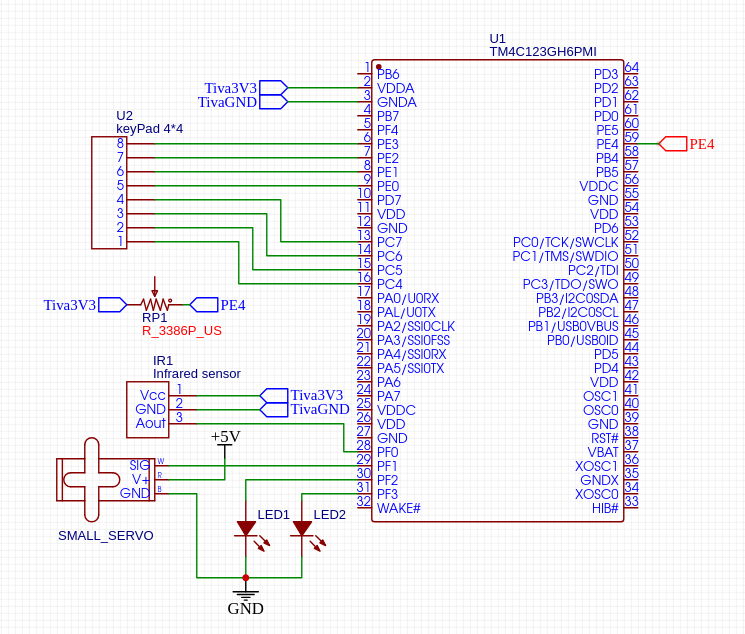

# Design and Implementation of a TM4C123 Embedded Security Lock

**Technical Design Report**  
**Authors:** Takeru Hiura and Shane Duffy

---

## Abstract

This project implements a low-cost embedded security lock using the Texas Instruments TM4C123GH6PM microcontroller. The prototype combines a 4x4 matrix keypad, potentiometer, infrared sensor, status LEDs, and a servo actuator with firmware built around GPIO, ADC, PWM, UART, interrupts, a watchdog timer, and a finite-state controller.

Access is evaluated using two conditions: a four-digit keypad credential and an analog threshold measured by the ADC. A successful attempt drives the servo to an unlocked position and updates the status indicators before automatically relocking. An active-low infrared sensor provides asynchronous intrusion detection through a GPIO interrupt, while the watchdog mechanism clears incomplete keypad entries after an inactivity interval. The design was verified incrementally at the peripheral level before full system integration.

## 1. System Overview

The system was designed as a self-contained embedded lock prototype with three primary goals:

1. accept a user-entered credential,
2. physically control a locking mechanism, and
3. detect an external intrusion event while the lock is engaged.

The TM4C123 acts as the central controller. Human input is provided by a 4x4 keypad and a potentiometer. The potentiometer is sampled with the microcontroller's 12-bit ADC and acts as an additional access condition. A servo motor provides the mechanical lock action, red and green LEDs indicate state, and UART provides text-based diagnostics. An infrared sensor on an interrupt-capable GPIO pin provides intrusion detection.


### 1.1 Functional requirements

The implemented prototype provides the following behavior:

- read a four-key access sequence from a 4x4 matrix keypad,
- sample an analog potentiometer value with ADC0,
- require both the correct keypad sequence and the configured ADC threshold for access,
- actuate a servo between calibrated locked and unlocked positions,
- indicate lock state with red and green LEDs,
- generate status messages over UART0,
- detect an active-low IR event with a GPIO interrupt,
- maintain `LOCKED`, `UNLOCKED`, and `INTRUDER` controller states, and
- clear an incomplete keypad entry after an inactivity timeout.

## 2. Hardware Architecture

The prototype is centered on the TM4C123GH6PM. Each peripheral is mapped to a dedicated microcontroller interface so that the access logic can be implemented without external processing hardware.

| Function | MCU pin(s) | Interface / role |
| --- | --- | --- |
| IR sensor | `PF0` | Active-low GPIO interrupt input |
| Servo | `PF1` | `PWM1 / M1PWM5` output |
| Green LED | `PF2` | GPIO status output |
| Red LED | `PF3` | GPIO status output |
| Potentiometer | `PE4` | `ADC0 / AIN9` analog input |
| Keypad rows | `PE0-PE3` | GPIO row-drive outputs |
| Keypad columns | `PC4-PC7` | GPIO inputs with pull-down resistors |
| UART RX | `PA0` | `UART0 RX` |
| UART TX | `PA1` | `UART0 TX` |

### 2.1 Keypad

The 4x4 keypad is scanned as a row-column matrix. The maintained firmware drives one row high at a time on `PE0-PE3` and reads the four column inputs on `PC4-PC7`. The column inputs use internal pull-down resistors, so a pressed key is detected when the active row is electrically connected to one of the column lines.

The detected row-column pair is translated through a 4x4 lookup table. Numeric keys are used for the configured four-digit credential; the remaining keypad symbols are still mapped by the scan routine. A key is accepted only once per press because the firmware waits for release before returning the mapped value.

### 2.2 ADC and potentiometer

The potentiometer is connected to `PE4`, which maps to ADC channel 9 (`AIN9`). ADC0 sample sequence 0 is configured for processor-triggered conversion. The ADC is 12-bit, producing values from 0 to 4095.

The original design selected an access threshold corresponding to approximately 1 V. With a 3.3 V full-scale ADC:

```text
Threshold ~= 4095 * (1.0 / 3.3) ~= 1241
```

The firmware therefore requires the ADC sample to exceed `1241` in addition to a valid keypad credential.

### 2.3 Servo and PWM

The servo provides the physical locking action. `PF1` is configured for `M1PWM5`, and PWM module 1 drives the output. The design uses an approximately 20 ms servo period and two empirically calibrated pulse widths representing the locked and unlocked positions.

The exact angular interpretation depends on the servo and mechanical mounting, so the firmware treats the two pulse widths as calibrated endpoints rather than relying on a fixed angle specification.

### 2.4 Infrared intrusion sensor

The infrared sensor output is connected to `PF0` and treated as active-low. A falling edge therefore represents a detection event. The GPIO interrupt handler clears the interrupt source and transitions the lock controller into the `INTRUDER` state.

### 2.5 Status LEDs and UART

`PF2` drives the green status LED and `PF3` drives the red status LED. The red LED indicates the lock is engaged; the green LED indicates the temporary unlocked state.

UART0 uses `PA0` and `PA1` at 115200 baud, 8 data bits, no parity, and one stop bit. It is used for initialization messages, key-entry acknowledgement, access results, timeout messages, relock notification, and intrusion alerts.

### 2.6 Hardware schematic

The connection diagram below captures the prototype wiring used during integration.



## 3. Firmware Architecture

The firmware is organized around peripheral initialization functions, small I/O service routines, and a three-state controller. The main loop repeatedly samples the potentiometer, checks for keypad input, evaluates a completed credential, and applies outputs associated with the active lock state.


### 3.1 State behavior

**LOCKED** is the default state. The red LED is enabled, the green LED is disabled, and the servo is commanded to the locked pulse width. The controller continues to accept keypad input and monitor the ADC.

**UNLOCKED** is entered after both access conditions are satisfied. The green LED is enabled, the red LED is disabled, and the servo moves to the unlocked pulse width. After approximately five seconds, the system automatically transitions back to `LOCKED`.

**INTRUDER** is entered by the IR sensor interrupt. The lock remains engaged, the red LED remains on, and an `INTRUDER ALERT` message is sent through UART. The current prototype does not implement an automatic authenticated exit from this state; adding explicit recovery behavior is a logical production improvement.

### 3.2 Credential processing

The configured keypad credential contains four entries. Each detected key is stored in a fixed-length input buffer. Once four entries have been received, the firmware compares the buffer against the configured credential and evaluates the current ADC sample.

Access is granted only when both conditions are true:

```text
keypad credential matches
AND
ADC sample > 1241
```

After either an accepted or rejected attempt, the input buffer is cleared for the next sequence.

### 3.3 Watchdog-based input timeout

The watchdog peripheral is used as an inactivity mechanism for partially entered credentials. Keypad activity suppresses the immediate timeout condition. If the timer expires while a partial sequence exists and no new key activity has occurred, the input buffer is reset and the user is notified through UART.

The maintained source configures the intended inactivity interval as 10 seconds.

### 3.4 Interrupt handling

The IR sensor is serviced asynchronously rather than through polling. A falling-edge interrupt on `PF0` invokes the intrusion handler, which updates the controller state and sends an alert. Keeping the intrusion event interrupt-driven allows the firmware to respond independently of normal keypad and ADC processing.

## 4. Verification Methodology

Development and testing were performed incrementally. Individual peripherals were exercised before the complete access-control sequence was assembled. This reduced integration ambiguity because a failure observed during system integration could be isolated to interactions between already verified subsystems rather than to an unknown peripheral implementation.

### 4.1 UART

UART functionality was verified by transmitting known status strings to a serial terminal. Successful output confirmed the UART peripheral setup and terminal configuration.

### 4.2 ADC

The potentiometer was swept across its range while the ADC result was monitored. The observed value ranged from approximately 0 to 4095, matching the expected 12-bit conversion range and confirming that the analog input path was functioning.

### 4.3 Keypad

Each keypad press was mapped to a row-column result and checked through UART feedback. The scan routine successfully distinguished individual keys and accepted complete four-key sequences. Waiting for key release prevented repeated entries from a single sustained press.

### 4.4 Interrupt and IR sensor

The IR sensor was used as the stimulus for the GPIO interrupt. Detection events produced the expected falling-edge interrupt, changed the controller to the intrusion state, and generated the corresponding UART alert.

### 4.5 State controller and LEDs

Each state was exercised while observing the red and green LED outputs. This provided direct visual confirmation that the output behavior followed the active controller state and that access events produced the intended transition sequence.

### 4.6 Servo control

Servo operation required pulse-width tuning and verification of the PWM period. After calibration, the actuator repeatedly moved between the two required mechanical positions in response to controller state changes.

### 4.7 Input timeout

An incomplete credential was intentionally left idle so that the watchdog-based timeout path could be observed. The partial entry was cleared and a timeout message was emitted, confirming the recovery behavior for abandoned input sequences.

## 5. Integration Results

The fully integrated prototype combined keypad input, ADC validation, state control, PWM servo actuation, LED feedback, UART diagnostics, IR intrusion sensing, and timeout handling in a single TM4C123 application.

A correct keypad sequence combined with an ADC sample above the configured threshold transitioned the system into the unlocked state. The servo moved to the calibrated open position, the green LED indicated access, and the system automatically re-engaged after the defined delay. Invalid input kept the lock engaged.

The IR sensor independently generated intrusion events through a GPIO interrupt. These events latched the controller in the intrusion state and produced immediate UART feedback while keeping the servo in the locked position.

The result demonstrates successful integration of multiple microcontroller peripherals into a coherent real-time control application rather than a collection of isolated peripheral examples.

## 6. Engineering Notes and Limitations

The current implementation is intentionally prototype-oriented. Several design choices are appropriate for demonstration but would be changed for a production access-control device:

- The access code is stored directly in firmware.
- The unlock interval uses a blocking delay rather than a non-blocking timer.
- There is no failed-attempt lockout policy.
- The intrusion state does not currently provide an authenticated recovery path.
- The design does not persist event history or credentials in nonvolatile storage.
- The mechanical assembly and electronics are not hardened against tampering.
- UART messages are diagnostic and are not a secure communications channel.

The maintained repository also corrects two inconsistencies between the original prototype source and its design documentation: the ADC threshold comparison is applied to the ADC sample, and the watchdog reload value is configured to match the documented 10-second inactivity interval.

## 7. Potential Extensions

Future revisions could improve both the firmware architecture and the physical system:

- replace the blocking unlock delay with a hardware timer or timestamp-based state transition,
- store configurable credentials in flash or EEPROM,
- add failed-attempt lockout and retry backoff,
- implement an explicit arm/disarm and intrusion-reset workflow,
- add an audible alarm or network notification path,
- log access and intrusion events with timestamps,
- encapsulate peripherals behind hardware-abstraction interfaces for easier testing,
- add host-side unit tests for credential and state-transition logic, and
- integrate the electronics and actuator into a mechanically secure enclosure or deadbolt mechanism.

## 8. Repository Implementation

The maintained source is available at [`../src/main.c`](../src/main.c). The code has been refactored to use named configuration constants, clearer state and function names, centralized UART helpers, explicit ADC completion handling, and concise documentation comments while preserving the intended hardware architecture.

## References

1. Texas Instruments / TM4C123 and TivaWare documentation used for device and peripheral configuration.
2. Microcontrollers Lab, *ADC TM4C123G Tiva C LaunchPad - Measure Analog Voltage Signal*.
3. TowerPro, *SG90 9g Micro Servo Datasheet*.
4. Parallax Inc., *4x4 Matrix Membrane Keypad (#27899) v1.2*, Dec. 2011.
5. Easy Electric, *Using Continuous Servo Motor with Tiva C Series TM4C123G LaunchPad - Part 2*, Feb. 20, 2021.
